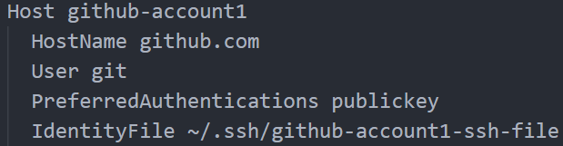

# GitHubMultiAccountSSH
Instruction on how to use SSH Keys with multiple Accounts on Windows and MacOS

## SSH Setup with no passephrase for key

- Create .ssh folder at root directory (~)
- create file config 
	- go in terminal and change directory (cd) to the created folder '.ssh' (cd .ssh)
	- type (touch config)
- create ssh keys
	- still in the .ssh folder type the command with your actual Email instead of the placeholder:
	- (ssh-keygen -t rsa -b 4096 -C "your_email@example.com")
	- Enter a file in which to save the key (/c/Users/YOU/.ssh):\[type your wanted name for the files\]
	- Enter passphrase (empty for no passphrase): \[just press enter\]
	- Enter same passphrase again: \[ just press enter again\]
- open your config file and add the following structure:
	- Host \[Name this so you know what it belongs to, when you later use it, name it something like "github-Account1", because you want to connect to github and this ist the ssh config for the "Account1"-Account. (Account1 stands for you GitHub account name in this case)\]
		  HostName \[this part defines the host you want to connect to, in this case it would be "github.com" \]
		  User \[this part defines with what user you want to connect, at GitHub, it would be "git"\]
		  PreferredAuthentications \[this part defines which key you want to use, in this case it is the publickey, so the value is "publickey"\]
		  IdentityFile \[and lastely this part wants the path to your ssh file, which we created earlier. For example "~/.ssh/your-ssh-file" (your-ssh-file stands for the file name of your ssh file)\]
- Here you can see an example entry
	 
- last step in the config file would be to add the following lines:
	 Host *
		AddKeysToAgent yes
- with that lines you assure, that your ssh-keys are added automatically to your ssh-agent when ever you want to use the ssh-Files and you don't have to add them manually

## Git remote origin

- in order for git to use ssh with the wanted ssh-key you have to add the public key to your trusted ssh keys in github, there are plenty of instructions on how to do that: [https://docs.github.com/de/authentication/connecting-to-github-with-ssh/adding-a-new-ssh-key-to-your-github-account](https://docs.github.com/de/authentication/connecting-to-github-with-ssh/adding-a-new-ssh-key-to-your-github-account)
- after that step is done, you are ready to use your ssh-key with github
- in order for it to work, just got to github and copy the ssh-clone command of your repo
- this looks something like this:
	- git@github.com:\[Your Account (Account1)\]/\[Your Repo\].git
- In order to use the ssh-config, just replace the standard "github.com"-part with the "Host" of your corresponding ssh-config
- with our example it would look like this:
	- git@github-account1:\[Your Account (Account1)\]/\[Your Repo\].git
- After you have done this you should be ready to use your repo as you normaly can

## Gitconfig Setup - MacOS

- the next step would be to look at the needed gitconfigs
	- in order for git to understand which ssh key you want to use, you have to specify it in the .gitconfig files
- therefore you want to add a ".gitconfig" file to your root Directory (~) if not existing yet
	- if there is one already, just edit it
- This .gitconfig is your Root-Config so you can go ahead and define a default User-Setup if you want one:
	- A basic User-Info would look like this:
	- \[user\]
		  name = Your Name
		  email = your_email@example.com
	- So you have an Object ("user") on which you can set different Attributes (if you want more detailed information on which Attributes each object has, just look it up yourself :))
	- In this case we set the name to the user-name of our default-user and the corresponding email